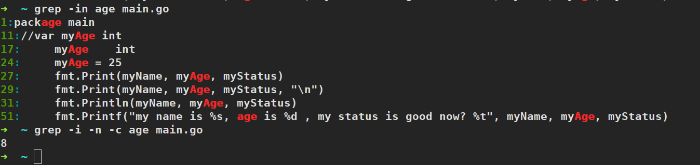
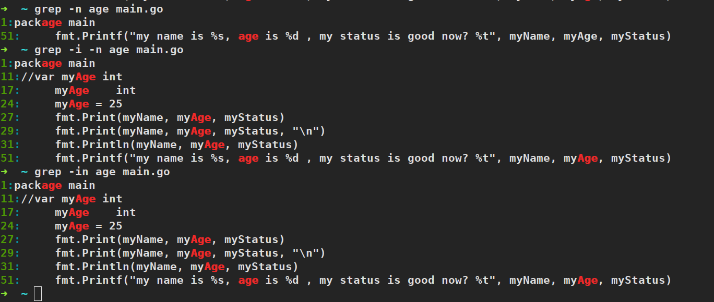
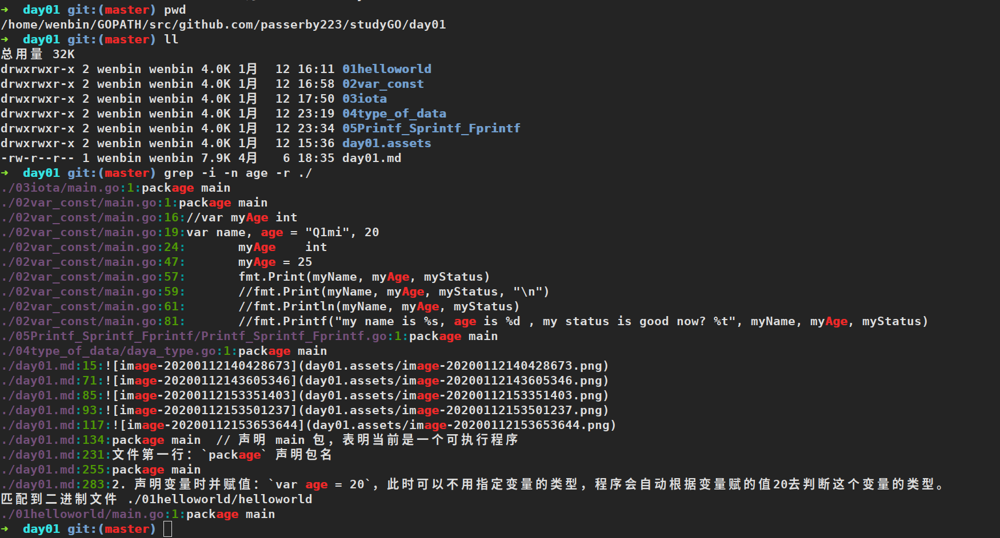
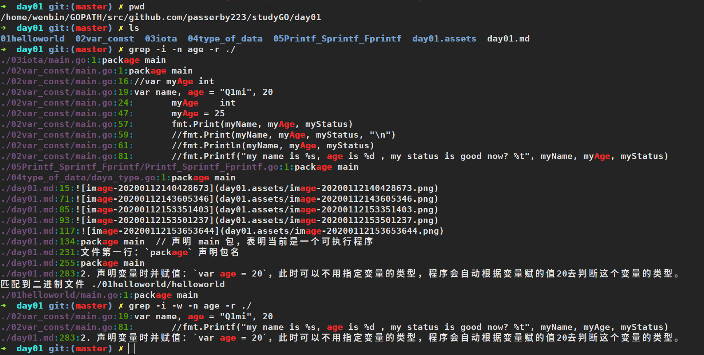
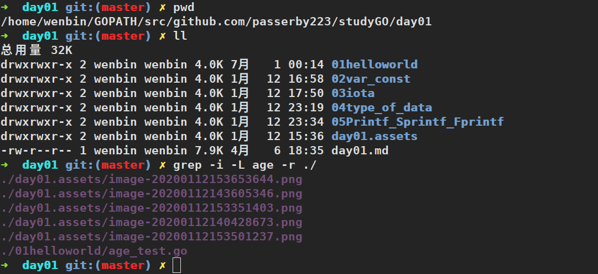
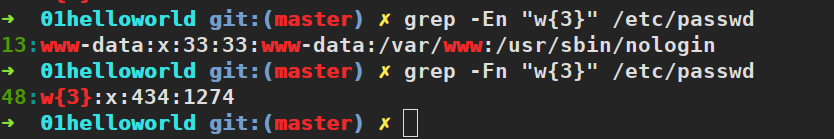

# 文本处理三剑客：`grep`,`sed`,`awk`
## grep
* `grep --help`查看grep命令帮助文档
```bash
[root@aliyun ~]$ grep --help
用法: grep [选项]... PATTERN [FILE]...
Search for PATTERN in each FILE.
Example: grep -i 'hello world' menu.h main.c

Pattern selection and interpretation:
  -E, --extended-regexp     PATTERN is an extended regular expression
  -F, --fixed-strings       PATTERN is a set of newline-separated strings
  -G, --basic-regexp        PATTERN is a basic regular expression (default)
  -P, --perl-regexp         PATTERN is a Perl regular expression
  -e, --regexp=PATTERN      用 PATTERN 来进行匹配操作
  -f, --file=FILE           从 FILE 中取得 PATTERN
  -i, --ignore-case         忽略大小写
  -w, --word-regexp         强制 PATTERN 仅完全匹配字词
  -x, --line-regexp         强制 PATTERN 仅完全匹配一行
  -z, --null-data           一个 0 字节的数据行，但不是空行

杂项:
  -s, --no-messages         不显示错误信息
  -v, --invert-match        选中不匹配的行
  -V, --version             显示版本信息并退出
      --help                显示此帮助并退出

Output control:
  -m, --max-count=NUM       stop after NUM selected lines
  -b, --byte-offset         print the byte offset with output lines
  -n, --line-number         print line number with output lines
      --line-buffered       flush output on every line
  -H, --with-filename       print file name with output lines
  -h, --no-filename         suppress the file name prefix on output
      --label=LABEL         use LABEL as the standard input file name prefix
  -o, --only-matching       只显示匹配PATTERN 部分的行
  -q, --quiet, --silent     不显示所有常规输出
      --binary-files=TYPE   设定二进制文件的TYPE 类型；
                            TYPE 可以是`binary', `text', 或`without-match'
  -a, --text                等同于 --binary-files=text
  -I                        等同于 --binary-files=without-match
  -d, --directories=ACTION  读取目录的方式；
                            ACTION 可以是`read', `recurse',或`skip'
  -D, --devices=ACTION      读取设备、先入先出队列、套接字的方式；
                            ACTION 可以是`read'或`skip'
  -r, --recursive           等同于--directories=recurse
  -R, --dereference-recursive       同上，但遍历所有符号链接
      --include=FILE_PATTERN  只查找匹配FILE_PATTERN 的文件
      --exclude=FILE_PATTERN  跳过匹配FILE_PATTERN 的文件和目录
      --exclude-from=FILE   跳过所有除FILE 以外的文件
      --exclude-dir=PATTERN  跳过所有匹配PATTERN 的目录。
  -L, --files-without-match  print only names of FILEs with no selected lines
  -l, --files-with-matches  print only names of FILEs with selected lines
  -c, --count               print only a count of selected lines per FILE
  -T, --initial-tab         make tabs line up (if needed)
  -Z, --null                print 0 byte after FILE name

文件控制:
  -B, --before-context=NUM  打印文本及其前面NUM 行
  -A, --after-context=NUM   打印文本及其后面NUM 行
  -C, --context=NUM         打印NUM 行输出文本
  -NUM                      same as --context=NUM
      --color[=WHEN],
      --colour[=WHEN]       use markers to highlight the matching strings;
                            WHEN is 'always', 'never', or 'auto'
  -U, --binary              do not strip CR characters at EOL (MSDOS/Windows)

When FILE is '-', read standard input.  With no FILE, read '.' if
recursive, '-' otherwise.  With fewer than two FILEs, assume -h.
Exit status is 0 if any line is selected, 1 otherwise;
if any error occurs and -q is not given, the exit status is 2.

请将错误报告给: bug-grep@gnu.org。翻译问题请报告至:Chinese (simplified) <i18n-zh@googlegroups.com>。
GNU grep 主页: <http://www.gnu.org/software/grep/>
GNU 软件的通用帮助: <http://www.gnu.org/gethelp/>
```
* 用法
    * `grep [option] [pattern] [file1, file2, ...]`
    * `some command | grep [option] [pattern]`
### 选项用法示例
* `-i`：忽略大小写
    
* `-c`：只输出匹配行的数量
    
* `-n`：显示行号
    
* `-r`：递归搜索
    
* `-E`：支持拓展正则表达式(默认`grep`后边只能使用基础的`正则表达式`，如果需要使用高级的`正则表达式`，则需要加上`-E`选项)
    
* `-w`：匹配整个单词
    
* `-L`：只列出匹配的文件名
    
* `-F`：不支持正则，按字符串字面意思进行匹配
    

## sed
TODO
    


