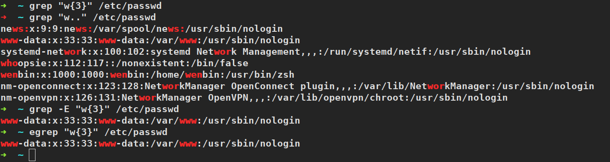

# 文本处理三剑客：`grep`,`sed`,`awk`
## grep
* `grep --help`查看`grep`命令帮助文档
    ```bash
    [root@aliyun ~]$ grep --help
    用法: grep [选项]... PATTERN [FILE]...
    Search for PATTERN in each FILE.
    Example: grep -i 'hello world' menu.h main.c
    
    Pattern selection and interpretation:
      -E, --extended-regexp     PATTERN is an extended regular expression
      -F, --fixed-strings       PATTERN is a set of newline-separated strings
      -G, --basic-regexp        PATTERN is a basic regular expression (default)
      -P, --perl-regexp         PATTERN is a Perl regular expression
      -e, --regexp=PATTERN      用 PATTERN 来进行匹配操作
      -f, --file=FILE           从 FILE 中取得 PATTERN
      -i, --ignore-case         忽略大小写
      -w, --word-regexp         强制 PATTERN 仅完全匹配字词
      -x, --line-regexp         强制 PATTERN 仅完全匹配一行
      -z, --null-data           一个 0 字节的数据行，但不是空行
    
    杂项:
      -s, --no-messages         不显示错误信息
      -v, --invert-match        选中不匹配的行
      -V, --version             显示版本信息并退出
          --help                显示此帮助并退出
    
    Output control:
      -m, --max-count=NUM       stop after NUM selected lines
      -b, --byte-offset         print the byte offset with output lines
      -n, --line-number         print line number with output lines
          --line-buffered       flush output on every line
      -H, --with-filename       print file name with output lines
      -h, --no-filename         suppress the file name prefix on output
          --label=LABEL         use LABEL as the standard input file name prefix
      -o, --only-matching       只显示匹配PATTERN 部分的行
      -q, --quiet, --silent     不显示所有常规输出
          --binary-files=TYPE   设定二进制文件的TYPE 类型；
                                TYPE 可以是`binary', `text', 或`without-match'
      -a, --text                等同于 --binary-files=text
      -I                        等同于 --binary-files=without-match
      -d, --directories=ACTION  读取目录的方式；
                                ACTION 可以是`read', `recurse',或`skip'
      -D, --devices=ACTION      读取设备、先入先出队列、套接字的方式；
                                ACTION 可以是`read'或`skip'
      -r, --recursive           等同于--directories=recurse
      -R, --dereference-recursive       同上，但遍历所有符号链接
          --include=FILE_PATTERN  只查找匹配FILE_PATTERN 的文件
          --exclude=FILE_PATTERN  跳过匹配FILE_PATTERN 的文件和目录
          --exclude-from=FILE   跳过所有除FILE 以外的文件
          --exclude-dir=PATTERN  跳过所有匹配PATTERN 的目录。
      -L, --files-without-match  print only names of FILEs with no selected lines
      -l, --files-with-matches  print only names of FILEs with selected lines
      -c, --count               print only a count of selected lines per FILE
      -T, --initial-tab         make tabs line up (if needed)
      -Z, --null                print 0 byte after FILE name
    
    文件控制:
      -B, --before-context=NUM  打印文本及其前面NUM 行
      -A, --after-context=NUM   打印文本及其后面NUM 行
      -C, --context=NUM         打印NUM 行输出文本
      -NUM                      same as --context=NUM
          --color[=WHEN],
          --colour[=WHEN]       use markers to highlight the matching strings;
                                WHEN is 'always', 'never', or 'auto'
      -U, --binary              do not strip CR characters at EOL (MSDOS/Windows)
    
    When FILE is '-', read standard input.  With no FILE, read '.' if
    recursive, '-' otherwise.  With fewer than two FILEs, assume -h.
    Exit status is 0 if any line is selected, 1 otherwise;
    if any error occurs and -q is not given, the exit status is 2.
    
    请将错误报告给: bug-grep@gnu.org。翻译问题请报告至:Chinese (simplified) <i18n-zh@googlegroups.com>。
    GNU grep 主页: <http://www.gnu.org/software/grep/>
    GNU 软件的通用帮助: <http://www.gnu.org/gethelp/>
    ```
* 用法
    * `grep [option] [pattern] [file1, file2, ...]`
    * `some command | grep [option] [pattern]`
### 选项用法示例
* `-i`：忽略大小写
    
* `-c`：只输出匹配行的数量
    
* `-n`：显示行号
    
* `-r`：递归搜索
    
* `-E`：支持拓展正则表达式(默认`grep`后边只能使用基础的`正则表达式`，如果需要使用高级的`正则表达式`，则需要加上`-E`选项)
    
* `-w`：匹配整个单词
    
* `-L`：只列出匹配的文件名
    
* `-F`：不支持正则，按字符串字面意思进行匹配
    

#### 查看当前登录用户是否在`/etc/passwd`文件下存在，存在就打印用户存在，不存在就打印用户不存在。
* `/dev/null`表示 的是一个黑洞，通常用于丢弃不需要的数据输出， 或者用于输入流的空文件
```bash
[root@aliyun ~]$ grep "$USER" /etc/passwd && echo "$USER existed" || "$USER not existed"            
wenbin:x:1000:1000:wenbin:/home/wenbin:/usr/bin/zsh
wenbin existed
[root@aliyun ~]$ grep "$USER" /etc/passwd &> /dev/null&& echo "$USER existed" || "$USER not existed" 
wenbin existed
```

## sed
* 流编辑器,对文本逐行进行处理
* `sed --help`查看`sed`命令帮助文档
    ```bash
    [root@aliyun ~]$ sed --help
    用法: sed [选项]... {脚本(如果没有其他脚本)} [输入文件]...
    
      -n, --quiet, --silent
                     取消自动打印模式空间
      -e 脚本, --expression=脚本
                     添加“脚本”到程序的运行列表
      -f 脚本文件, --file=脚本文件
                     添加“脚本文件”到程序的运行列表
      --follow-symlinks
                     直接修改文件时跟随软链接
      -i[SUFFIX], --in-place[=SUFFIX]
                     edit files in place (makes backup if SUFFIX supplied)
      -l N, --line-length=N
                     指定“l”命令的换行期望长度
      --posix
                     关闭所有 GNU 扩展
      -E, -r, --regexp-extended
                     use extended regular expressions in the script
                     (for portability use POSIX -E).
      -s, --separate
                     consider files as separate rather than as a single,
                     continuous long stream.
          --sandbox
                     operate in sandbox mode.
      -u, --unbuffered
                     从输入文件读取最少的数据，更频繁的刷新输出
      -z, --null-data
                     使用 NUL 字符分隔各行
          --help     打印帮助并退出
          --version  输出版本信息并退出
    
    如果没有 -e, --expression, -f 或 --file 选项，那么第一个非选项参数被视为
    sed脚本。其他非选项参数被视为输入文件，如果没有输入文件，那么程序将从标准
    输入读取数据。
    
    GNU版sed主页： <http://www.gnu.org/software/sed/>。
    使用GNU软件所需帮助文档： <http://www.gnu.org/gethelp/>。
    请将错误报告发送至：<bug-sed@gnu.org>。
    ```
* 用法
    * `sed [option] "pattern command" file`
    * `some command | sed [option] "pattern command"`
### 用法选项[option]
* `-n`：只打印模式匹配的行
* `-f`：加载存放动作的文件
* `-r`：支持拓展正则
* `-i`：直接修改文件
### pattern模式
* `5`：只处理第5行
* `5,10`：只处理第`5`行到第`10`行
* `/pattern1/`：只处理能匹配`pattern1`的行
* `/pattern1/,/pattern2/`：只处理从匹配`pattern1`的行到匹配`pattern2`的行
### command命令
* 查询
    * `p`:打印
* 新增
    * `a`：在匹配行后新增
    * `i`：在匹配行前新增
    * `r`：读入外部文件的内容，新增到匹配行的后面
    * `w`：将匹配行的内容写入到一个外部文件中
* 删除
    * `d`
* 修改
    * `s/old/new/`：只修改匹配行中第一个`old`
    * `s/old/new/g`：修改匹配行中所有`old`
    * `s/old/new/ig`：忽略大小写

### 用法示例
测试文件内容如下
```bash
[root@aliyun ~]$ cat -n passwd
     1	root:x:0:0:root:/root:/bin/bash
     2	daemon:x:1:1:daemon:/usr/sbin:/usr/sbin/nologin
     3	bin:x:2:2:bin:/bin:/usr/sbin/nologin
     4	sys:x:3:3:sys:/dev:/usr/sbin/nologin
     5	sync:x:4:65534:sync:/bin:/bin/sync
     6	games:x:5:60:games:/usr/games:/usr/sbin/nologin
     7	man:x:6:12:man:/var/cache/man:/usr/sbin/nologin
     8	lp:x:7:7:lp:/var/spool/lpd:/usr/sbin/nologin
     9	mail:x:8:8:mail:/var/mail:/usr/sbin/nologin
    10	news:x:9:9:news:/var/spool/news:/usr/sbin/nologin
    11	uucp:x:10:10:uucp:/var/spool/uucp:/usr/sbin/nologin
    12	proxy:x:13:13:proxy:/bin:/usr/sbin/nologin
    13	www-data:x:33:33:www-data:/var/www:/usr/sbin/nologin
    14	backup:x:34:34:backup:/var/backups:/usr/sbin/nologin
    15	list:x:38:38:Mailing List Manager:/var/list:/usr/sbin/nologin
    16	irc:x:39:39:ircd:/var/run/ircd:/usr/sbin/nologin
    17	list:x:40:40:Phone List Manager:/var/list:/usr/sbin/nologin
    18	gnats:x:41:41:Gnats Bug-Reporting System (admin):/var/lib/gnats:/usr/sbin/nologin
    19	nobody:x:65534:65534:nobody:/nonexistent:/usr/sbin/nologin
    20	systemd-network:x:100:102:systemd Network Management,,,:/run/systemd/netif:/usr/sbin/nologin
    21	systemd-resolve:x:101:103:systemd Resolver,,,:/run/systemd/resolve:/usr/sbin/nologin
    22	syslog:x:102:106::/home/syslog:/usr/sbin/nologin
    23	messagebus:x:103:107::/nonexistent:/usr/sbin/nologin
    24	_apt:x:104:65534::/nonexistent:/usr/sbin/nologin
    25	uuidd:x:105:111::/run/uuidd:/usr/sbin/nologin
    26	avahi-autoipd:x:106:112:Avahi autoip daemon,,,:/var/lib/avahi-autoipd:/usr/sbin/nologin
    27	usbmux:x:107:46:usbmux daemon,,,:/var/lib/usbmux:/usr/sbin/nologin
    28	dnsmasq:x:108:65534:dnsmasq,,,:/var/lib/misc:/usr/sbin/nologin
    29	rtkit:x:109:114:RealtimeKit,,,:/proc:/usr/sbin/nologin
    30	cups-pk-helper:x:110:116:user for cups-pk-helper service,,,:/home/cups-pk-helper:/usr/sbin/nologin
    31	speech-dispatcher:x:111:29:Speech Dispatcher,,,:/var/run/speech-dispatcher:/bin/false
    32	whoopsie:x:112:117::/nonexistent:/bin/false
    33	kernoops:x:113:65534:Kernel Oops Tracking Daemon,,,:/:/usr/sbin/nologin
    34	saned:x:114:119::/var/lib/saned:/usr/sbin/nologin
    35	pulse:x:115:120:PulseAudio daemon,,,:/var/run/pulse:/usr/sbin/nologin
    36	avahi:x:116:122:Avahi mDNS daemon,,,:/var/run/avahi-daemon:/usr/sbin/nologin
    37	colord:x:117:123:colord colour management daemon,,,:/var/lib/colord:/usr/sbin/nologin
    38	hplip:x:118:7:HPLIP system user,,,:/var/run/hplip:/bin/false
    39	geoclue:x:119:124::/var/lib/geoclue:/usr/sbin/nologin
    40	gnome-initial-setup:x:120:65534::/run/gnome-initial-setup/:/bin/false
    41	gdm:x:121:125:Gnome Display Manager:/var/lib/gdm3:/bin/false
    42	wenbin:x:1000:1000:wenbin:/home/wenbin:/usr/bin/zsh
    43	nm-openconnect:x:123:128:NetworkManager OpenConnect plugin,,,:/var/lib/NetworkManager:/usr/sbin/nologin
    44	clamav:x:125:129::/var/lib/clamav:/bin/false
    45	nvidia-persistenced:x:122:127:NVIDIA Persistence Daemon,,,:/nonexistent:/sbin/nologin
    46	mysql:x:124:130:MySQL Server,,,:/var/lib/mysql:/bin/false
    47	nm-openvpn:x:126:131:NetworkManager OpenVPN,,,:/var/lib/openvpn/chroot:/usr/sbin/nologin
    48	memcache:x:127:133:Memcached,,,:/nonexistent:/bin/false
```
#### 查看
* 查看文件第5行内容
```bash
[root@aliyun ~]$ sed -n '5 p' passwd
sync:x:4:65534:sync:/bin:/bin/sync
```
* 查看文件第1行到第5行的内容
```bash
[root@aliyun ~]$ sed -n '1,5 p' passwd      
root:x:0:0:root:/root:/bin/bash
daemon:x:1:1:daemon:/usr/sbin:/usr/sbin/nologin
bin:x:2:2:bin:/bin:/usr/sbin/nologin
sys:x:3:3:sys:/dev:/usr/sbin/nologin
sync:x:4:65534:sync:/bin:/bin/sync
```
* 查看文件中包含`mail`字符串的行的内容
```bash
[root@aliyun ~]$ sed -n '/mail/ p' passwd   
mail:x:8:8:mail:/var/mail:/usr/sbin/nologin
```
* 查看文件中以`m`开头,`login`结尾的行的内容
```bash
[root@aliyun ~]$ sed -n '/^m.*login$/ p' passwd
man:x:6:12:man:/var/cache/man:/usr/sbin/nologin
mail:x:8:8:mail:/var/mail:/usr/sbin/nologin
messagebus:x:103:107::/nonexistent:/usr/sbin/nologin
```
* 查看文件中从**包含`list`字符串所在行**到**包含`nobody`字符串所在行**的**所有行的内容**
```bash
[root@aliyun ~]$ sed -n '/list/,/nobody/ p' passwd
list:x:38:38:Mailing List Manager:/var/list:/usr/sbin/nologin
irc:x:39:39:ircd:/var/run/ircd:/usr/sbin/nologin
list:x:40:40:Phone List Manager:/var/list:/usr/sbin/nologin
gnats:x:41:41:Gnats Bug-Reporting System (admin):/var/lib/gnats:/usr/sbin/nologin
nobody:x:65534:65534:nobody:/nonexistent:/usr/sbin/nologin
```
#### 增加
* 在从以`proxy`开头的行到以`list`开头的行的行的所有行**之后**新增一行，新增行的内容为`sed行前新增的内容`
```bash
[root@aliyun ~]$ sed -i '/^proxy/,/^list/ a sed行前新增的内容' passwd  
[root@aliyun ~]$ cat -n passwd 
     1	root:x:0:0:root:/root:/bin/bash
     2	daemon:x:1:1:daemon:/usr/sbin:/usr/sbin/nologin
     3	bin:x:2:2:bin:/bin:/usr/sbin/nologin
     4	sys:x:3:3:sys:/dev:/usr/sbin/nologin
     5	sync:x:4:65534:sync:/bin:/bin/sync
     6	games:x:5:60:games:/usr/games:/usr/sbin/nologin
     7	man:x:6:12:man:/var/cache/man:/usr/sbin/nologin
     8	lp:x:7:7:lp:/var/spool/lpd:/usr/sbin/nologin
     9	mail:x:8:8:mail:/var/mail:/usr/sbin/nologin
    10	news:x:9:9:news:/var/spool/news:/usr/sbin/nologin
    11	uucp:x:10:10:uucp:/var/spool/uucp:/usr/sbin/nologin
    12	proxy:x:13:13:proxy:/bin:/usr/sbin/nologin
    13	sed行前新增的内容
    14	www-data:x:33:33:www-data:/var/www:/usr/sbin/nologin
    15	sed行前新增的内容
    16	backup:x:34:34:backup:/var/backups:/usr/sbin/nologin
    17	sed行前新增的内容
    18	list:x:38:38:Mailing List Manager:/var/list:/usr/sbin/nologin
    19	sed行前新增的内容
    20	irc:x:39:39:ircd:/var/run/ircd:/usr/sbin/nologin
    21	list:x:40:40:Phone List Manager:/var/list:/usr/sbin/nologin
    22	gnats:x:41:41:Gnats Bug-Reporting System (admin):/var/lib/gnats:/usr/sbin/nologin
    23	nobody:x:65534:65534:nobody:/nonexistent:/usr/sbin/nologin
    24	systemd-network:x:100:102:systemd Network Management,,,:/run/systemd/netif:/usr/sbin/nologin
    25	systemd-resolve:x:101:103:systemd Resolver,,,:/run/systemd/resolve:/usr/sbin/nologin
    26	syslog:x:102:106::/home/syslog:/usr/sbin/nologin
    27	messagebus:x:103:107::/nonexistent:/usr/sbin/nologin
    28	_apt:x:104:65534::/nonexistent:/usr/sbin/nologin
    29	uuidd:x:105:111::/run/uuidd:/usr/sbin/nologin
    30	avahi-autoipd:x:106:112:Avahi autoip daemon,,,:/var/lib/avahi-autoipd:/usr/sbin/nologin
    31	usbmux:x:107:46:usbmux daemon,,,:/var/lib/usbmux:/usr/sbin/nologin
    32	dnsmasq:x:108:65534:dnsmasq,,,:/var/lib/misc:/usr/sbin/nologin
    33	rtkit:x:109:114:RealtimeKit,,,:/proc:/usr/sbin/nologin
    34	cups-pk-helper:x:110:116:user for cups-pk-helper service,,,:/home/cups-pk-helper:/usr/sbin/nologin
    35	speech-dispatcher:x:111:29:Speech Dispatcher,,,:/var/run/speech-dispatcher:/bin/false
    36	whoopsie:x:112:117::/nonexistent:/bin/false
    37	kernoops:x:113:65534:Kernel Oops Tracking Daemon,,,:/:/usr/sbin/nologin
    38	saned:x:114:119::/var/lib/saned:/usr/sbin/nologin
    39	pulse:x:115:120:PulseAudio daemon,,,:/var/run/pulse:/usr/sbin/nologin
    40	avahi:x:116:122:Avahi mDNS daemon,,,:/var/run/avahi-daemon:/usr/sbin/nologin
    41	colord:x:117:123:colord colour management daemon,,,:/var/lib/colord:/usr/sbin/nologin
    42	hplip:x:118:7:HPLIP system user,,,:/var/run/hplip:/bin/false
    43	geoclue:x:119:124::/var/lib/geoclue:/usr/sbin/nologin
    44	gnome-initial-setup:x:120:65534::/run/gnome-initial-setup/:/bin/false
    45	gdm:x:121:125:Gnome Display Manager:/var/lib/gdm3:/bin/false
    46	wenbin:x:1000:1000:wenbin:/home/wenbin:/usr/bin/zsh
    47	nm-openconnect:x:123:128:NetworkManager OpenConnect plugin,,,:/var/lib/NetworkManager:/usr/sbin/nologin
    48	clamav:x:125:129::/var/lib/clamav:/bin/false
    49	nvidia-persistenced:x:122:127:NVIDIA Persistence Daemon,,,:/nonexistent:/sbin/nologin
    50	mysql:x:124:130:MySQL Server,,,:/var/lib/mysql:/bin/false
    51	nm-openvpn:x:126:131:NetworkManager OpenVPN,,,:/var/lib/openvpn/chroot:/usr/sbin/nologin
    52	memcache:x:127:133:Memcached,,,:/nonexistent:/bin/false
```
* 在从以`proxy`开头的行到以`list`开头的行的行的所有行**之前**新增一行，新增行的内容为`sed行后新增的内容`
```bash
[root@aliyun ~]$ sed -i '/^proxy/,/^list/ a sed行后新增的内容' passwd
[root@aliyun ~]$ cat -n passwd                                       
     1	root:x:0:0:root:/root:/bin/bash
     2	daemon:x:1:1:daemon:/usr/sbin:/usr/sbin/nologin
     3	bin:x:2:2:bin:/bin:/usr/sbin/nologin
     4	sys:x:3:3:sys:/dev:/usr/sbin/nologin
     5	sync:x:4:65534:sync:/bin:/bin/sync
     6	games:x:5:60:games:/usr/games:/usr/sbin/nologin
     7	man:x:6:12:man:/var/cache/man:/usr/sbin/nologin
     8	lp:x:7:7:lp:/var/spool/lpd:/usr/sbin/nologin
     9	mail:x:8:8:mail:/var/mail:/usr/sbin/nologin
    10	news:x:9:9:news:/var/spool/news:/usr/sbin/nologin
    11	uucp:x:10:10:uucp:/var/spool/uucp:/usr/sbin/nologin
    12	proxy:x:13:13:proxy:/bin:/usr/sbin/nologin
    13	sed行后新增的内容
    14	www-data:x:33:33:www-data:/var/www:/usr/sbin/nologin
    15	sed行后新增的内容
    16	backup:x:34:34:backup:/var/backups:/usr/sbin/nologin
    17	sed行后新增的内容
    18	list:x:38:38:Mailing List Manager:/var/list:/usr/sbin/nologin
    19	sed行后新增的内容
    20	irc:x:39:39:ircd:/var/run/ircd:/usr/sbin/nologin
    21	list:x:40:40:Phone List Manager:/var/list:/usr/sbin/nologin
    22	gnats:x:41:41:Gnats Bug-Reporting System (admin):/var/lib/gnats:/usr/sbin/nologin
    23	nobody:x:65534:65534:nobody:/nonexistent:/usr/sbin/nologin
    24	systemd-network:x:100:102:systemd Network Management,,,:/run/systemd/netif:/usr/sbin/nologin
    25	systemd-resolve:x:101:103:systemd Resolver,,,:/run/systemd/resolve:/usr/sbin/nologin
    26	syslog:x:102:106::/home/syslog:/usr/sbin/nologin
    27	messagebus:x:103:107::/nonexistent:/usr/sbin/nologin
    28	_apt:x:104:65534::/nonexistent:/usr/sbin/nologin
    29	uuidd:x:105:111::/run/uuidd:/usr/sbin/nologin
    30	avahi-autoipd:x:106:112:Avahi autoip daemon,,,:/var/lib/avahi-autoipd:/usr/sbin/nologin
    31	usbmux:x:107:46:usbmux daemon,,,:/var/lib/usbmux:/usr/sbin/nologin
    32	dnsmasq:x:108:65534:dnsmasq,,,:/var/lib/misc:/usr/sbin/nologin
    33	rtkit:x:109:114:RealtimeKit,,,:/proc:/usr/sbin/nologin
    34	cups-pk-helper:x:110:116:user for cups-pk-helper service,,,:/home/cups-pk-helper:/usr/sbin/nologin
    35	speech-dispatcher:x:111:29:Speech Dispatcher,,,:/var/run/speech-dispatcher:/bin/false
    36	whoopsie:x:112:117::/nonexistent:/bin/false
    37	kernoops:x:113:65534:Kernel Oops Tracking Daemon,,,:/:/usr/sbin/nologin
    38	saned:x:114:119::/var/lib/saned:/usr/sbin/nologin
    39	pulse:x:115:120:PulseAudio daemon,,,:/var/run/pulse:/usr/sbin/nologin
    40	avahi:x:116:122:Avahi mDNS daemon,,,:/var/run/avahi-daemon:/usr/sbin/nologin
    41	colord:x:117:123:colord colour management daemon,,,:/var/lib/colord:/usr/sbin/nologin
    42	hplip:x:118:7:HPLIP system user,,,:/var/run/hplip:/bin/false
    43	geoclue:x:119:124::/var/lib/geoclue:/usr/sbin/nologin
    44	gnome-initial-setup:x:120:65534::/run/gnome-initial-setup/:/bin/false
    45	gdm:x:121:125:Gnome Display Manager:/var/lib/gdm3:/bin/false
    46	wenbin:x:1000:1000:wenbin:/home/wenbin:/usr/bin/zsh
    47	nm-openconnect:x:123:128:NetworkManager OpenConnect plugin,,,:/var/lib/NetworkManager:/usr/sbin/nologin
    48	clamav:x:125:129::/var/lib/clamav:/bin/false
    49	nvidia-persistenced:x:122:127:NVIDIA Persistence Daemon,,,:/nonexistent:/sbin/nologin
    50	mysql:x:124:130:MySQL Server,,,:/var/lib/mysql:/bin/false
    51	nm-openvpn:x:126:131:NetworkManager OpenVPN,,,:/var/lib/openvpn/chroot:/usr/sbin/nologin
    52	memcache:x:127:133:Memcached,,,:/nonexistent:/bin/false
```
* 在从以`proxy`开头的行到以`list`开头的行的行的所有行**之后**新增从`test.txt`文件中读取到的内容
```bash
[root@aliyun ~]$ cat -n test.txt
     1	[root@root-aliyun ~]$ /bin/bash while_loop.sh
     2	请输入一个数字>>>100
     3	从1累加到100的结果为：5050
[root@aliyun ~]$ sed -i '/^proxy/,/^list/ r test.txt' passwd         
[root@aliyun ~]$ cat -n passwd                              
     1	root:x:0:0:root:/root:/bin/bash
     2	daemon:x:1:1:daemon:/usr/sbin:/usr/sbin/nologin
     3	bin:x:2:2:bin:/bin:/usr/sbin/nologin
     4	sys:x:3:3:sys:/dev:/usr/sbin/nologin
     5	sync:x:4:65534:sync:/bin:/bin/sync
     6	games:x:5:60:games:/usr/games:/usr/sbin/nologin
     7	man:x:6:12:man:/var/cache/man:/usr/sbin/nologin
     8	lp:x:7:7:lp:/var/spool/lpd:/usr/sbin/nologin
     9	mail:x:8:8:mail:/var/mail:/usr/sbin/nologin
    10	news:x:9:9:news:/var/spool/news:/usr/sbin/nologin
    11	uucp:x:10:10:uucp:/var/spool/uucp:/usr/sbin/nologin
    12	proxy:x:13:13:proxy:/bin:/usr/sbin/nologin
    13	[root@root-aliyun ~]$ /bin/bash while_loop.sh
    14	请输入一个数字>>>100
    15	从1累加到100的结果为：5050
    16	www-data:x:33:33:www-data:/var/www:/usr/sbin/nologin
    17	[root@root-aliyun ~]$ /bin/bash while_loop.sh
    18	请输入一个数字>>>100
    19	从1累加到100的结果为：5050
    20	backup:x:34:34:backup:/var/backups:/usr/sbin/nologin
    21	[root@root-aliyun ~]$ /bin/bash while_loop.sh
    22	请输入一个数字>>>100
    23	从1累加到100的结果为：5050
    24	list:x:38:38:Mailing List Manager:/var/list:/usr/sbin/nologin
    25	[root@root-aliyun ~]$ /bin/bash while_loop.sh
    26	请输入一个数字>>>100
    27	从1累加到100的结果为：5050
    28	irc:x:39:39:ircd:/var/run/ircd:/usr/sbin/nologin
    29	list:x:40:40:Phone List Manager:/var/list:/usr/sbin/nologin
    30	gnats:x:41:41:Gnats Bug-Reporting System (admin):/var/lib/gnats:/usr/sbin/nologin
    31	nobody:x:65534:65534:nobody:/nonexistent:/usr/sbin/nologin
    32	systemd-network:x:100:102:systemd Network Management,,,:/run/systemd/netif:/usr/sbin/nologin
    33	systemd-resolve:x:101:103:systemd Resolver,,,:/run/systemd/resolve:/usr/sbin/nologin
    34	syslog:x:102:106::/home/syslog:/usr/sbin/nologin
    35	messagebus:x:103:107::/nonexistent:/usr/sbin/nologin
    36	_apt:x:104:65534::/nonexistent:/usr/sbin/nologin
    37	uuidd:x:105:111::/run/uuidd:/usr/sbin/nologin
    38	avahi-autoipd:x:106:112:Avahi autoip daemon,,,:/var/lib/avahi-autoipd:/usr/sbin/nologin
    39	usbmux:x:107:46:usbmux daemon,,,:/var/lib/usbmux:/usr/sbin/nologin
    40	dnsmasq:x:108:65534:dnsmasq,,,:/var/lib/misc:/usr/sbin/nologin
    41	rtkit:x:109:114:RealtimeKit,,,:/proc:/usr/sbin/nologin
    42	cups-pk-helper:x:110:116:user for cups-pk-helper service,,,:/home/cups-pk-helper:/usr/sbin/nologin
    43	speech-dispatcher:x:111:29:Speech Dispatcher,,,:/var/run/speech-dispatcher:/bin/false
    44	whoopsie:x:112:117::/nonexistent:/bin/false
    45	kernoops:x:113:65534:Kernel Oops Tracking Daemon,,,:/:/usr/sbin/nologin
    46	saned:x:114:119::/var/lib/saned:/usr/sbin/nologin
    47	pulse:x:115:120:PulseAudio daemon,,,:/var/run/pulse:/usr/sbin/nologin
    48	avahi:x:116:122:Avahi mDNS daemon,,,:/var/run/avahi-daemon:/usr/sbin/nologin
    49	colord:x:117:123:colord colour management daemon,,,:/var/lib/colord:/usr/sbin/nologin
    50	hplip:x:118:7:HPLIP system user,,,:/var/run/hplip:/bin/false
    51	geoclue:x:119:124::/var/lib/geoclue:/usr/sbin/nologin
    52	gnome-initial-setup:x:120:65534::/run/gnome-initial-setup/:/bin/false
    53	gdm:x:121:125:Gnome Display Manager:/var/lib/gdm3:/bin/false
    54	wenbin:x:1000:1000:wenbin:/home/wenbin:/usr/bin/zsh
    55	nm-openconnect:x:123:128:NetworkManager OpenConnect plugin,,,:/var/lib/NetworkManager:/usr/sbin/nologin
    56	clamav:x:125:129::/var/lib/clamav:/bin/false
    57	nvidia-persistenced:x:122:127:NVIDIA Persistence Daemon,,,:/nonexistent:/sbin/nologin
    58	mysql:x:124:130:MySQL Server,,,:/var/lib/mysql:/bin/false
    59	nm-openvpn:x:126:131:NetworkManager OpenVPN,,,:/var/lib/openvpn/chroot:/usr/sbin/nologin
    60	memcache:x:127:133:Memcached,,,:/nonexistent:/bin/false
```
* 将以`proxy`开头的行到以`list`开头的行的行的所有行写入到一个外部文件`output.txt`中
```bash
[root@aliyun ~]$ sed -i '/^proxy/,/^list/ w output.txt' passwd
[root@aliyun ~]$ cat -n output.txt 
     1	proxy:x:13:13:proxy:/bin:/usr/sbin/nologin
     2	www-data:x:33:33:www-data:/var/www:/usr/sbin/nologin
     3	backup:x:34:34:backup:/var/backups:/usr/sbin/nologin
     4	list:x:38:38:Mailing List Manager:/var/list:/usr/sbin/nologin
```
#### 删除
* 删除文本中包含`www`字符串的行
```bash
[root@aliyun ~]$ sed -n '/www/ p' passwd
www-data:x:33:33:www-data:/var/www:/usr/sbin/nologin
[root@aliyun ~]$ sed -i '/www/ d' passwd
[root@aliyun ~]$ sed -n '/www/ p' passwd
```
#### 修改
测试文件内容如下
```bash
This new method does not require an existing physical/virtual macOS installation. 
However, this new method requires internet access during the macOS installation process. 
This limitation may be addressed in a future commit.
Python is interesting!python,Python,python
Java is interesting!
Python is interesting!python,Python,python
Go is interesting!
Python is interesting!python,Python,python
This README documents the new method to install macOS. 
The older README is available here.
```
* 修改第4行到第8行中第一个`Python`为`PYTHON`
```bash
[root@aliyun ~]$ cat -n test1.txt
     1	This new method does not require an existing physical/virtual macOS installation. 
     2	However, this new method requires internet access during the macOS installation process. 
     3	This limitation may be addressed in a future commit.
     4	Python is interesting!python,Python,python
     5	Java is interesting!
     6	Python is interesting!python,Python,python
     7	Go is interesting!
     8	Python is interesting!python,Python,python
     9	This README documents the new method to install macOS. 
    10	The older README is available here.
[root@aliyun ~]$ sed -i '4,8 s/Python/PYTHON/' test1.txt
[root@aliyun ~]$ cat -n test1.txt                       
     1	This new method does not require an existing physical/virtual macOS installation. 
     2	However, this new method requires internet access during the macOS installation process. 
     3	This limitation may be addressed in a future commit.
     4	PYTHON is interesting!python,Python,python
     5	Java is interesting!
     6	PYTHON is interesting!python,Python,python
     7	Go is interesting!
     8	PYTHON is interesting!python,Python,python
     9	This README documents the new method to install macOS. 
    10	The older README is available here.
```
* 修改第4行到第8行中所有的`Python`为`PYTHON`
```bash
[root@aliyun ~]$ cat -n test1.txt
     1	This new method does not require an existing physical/virtual macOS installation. 
     2	However, this new method requires internet access during the macOS installation process. 
     3	This limitation may be addressed in a future commit.
     4	Python is interesting!python,Python,python
     5	Java is interesting!
     6	Python is interesting!python,Python,python
     7	Go is interesting!
     8	Python is interesting!python,Python,python
     9	This README documents the new method to install macOS. 
    10	The older README is available here.
[root@aliyun ~]$ sed -i '4,8 s/Python/PYTHON/g' test1.txt
[root@aliyun ~]$ cat -n test1.txt                        
     1	This new method does not require an existing physical/virtual macOS installation. 
     2	However, this new method requires internet access during the macOS installation process. 
     3	This limitation may be addressed in a future commit.
     4	PYTHON is interesting!python,PYTHON,python
     5	Java is interesting!
     6	PYTHON is interesting!python,PYTHON,python
     7	Go is interesting!
     8	PYTHON is interesting!python,PYTHON,python
     9	This README documents the new method to install macOS. 
    10	The older README is available here.
```
* 修改第4行到第8行中所有的`Python`为`PYTHON`，忽略大小写，也包含`python`
```bash
[root@aliyun ~]$ cat -n test1.txt
     1	This new method does not require an existing physical/virtual macOS installation. 
     2	However, this new method requires internet access during the macOS installation process. 
     3	This limitation may be addressed in a future commit.
     4	Python is interesting!python,Python,python
     5	Java is interesting!
     6	Python is interesting!python,Python,python
     7	Go is interesting!
     8	Python is interesting!python,Python,python
     9	This README documents the new method to install macOS. 
    10	The older README is available here.
[root@aliyun ~]$ sed -i '4,8 s/Python/PYTHON/ig' test1.txt
[root@aliyun ~]$ cat -n test1.txt                         
     1	This new method does not require an existing physical/virtual macOS installation. 
     2	However, this new method requires internet access during the macOS installation process. 
     3	This limitation may be addressed in a future commit.
     4	PYTHON is interesting!PYTHON,PYTHON,PYTHON
     5	Java is interesting!
     6	PYTHON is interesting!PYTHON,PYTHON,PYTHON
     7	Go is interesting!
     8	PYTHON is interesting!PYTHON,PYTHON,PYTHON
     9	This README documents the new method to install macOS. 
    10	The older README is available here.
```

